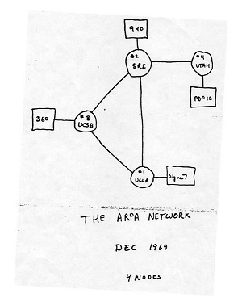
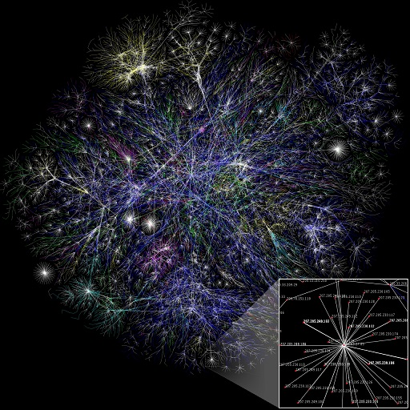

## The Internet in Nodes

When simply navigating the Internet it is not always clear how interconnected the websites and pages that call the net home are. Originally drawn on a napkin for the US military, the ARPANet that would become the Internet was planned out 8 nodes. These nodes were easily represented on a graph, and paths from one node to another were easy to see. The modern internet had millions of nodes making up the backbone alone. A graphical representation of such a medium is nearly indecipherable for the human, and functions best simply as a proof of the sheer scale of the system. 

The ARPA network as designed on a napkin in 1969    |  The rough backbone of the modern Internet
:--------------------------------------------------:|:--------------------------------------------------:
  |  

This site seeks to explore the ways in which the modern Internet is more useful as complex connection of media than a medium in it of itself. In terms of meta-analysis, the Internet is a particularly interesting medium being one of the most technical and wide reaching of modernly used media. However, the different ways in which "text" can be portrayed with computer technology and hosted on the Internet add new and important layers with which to view said medium.

### The Wikipedia Philosophy Phenomenon 

A unique phenomenon exists on Wikipedia in which 97% (as of February 2016) of articles eventually link to the article on Philosophy by following the first **non-italicized, non-parenthesized** existing link to another article. Almost all articles on Wikipedia are connected to others through links on the page. The articles can be represented as nodes on a graph, just as pages / sites on the Internet are. In doing so, one can see the various paths, connections, and unexpected relations that these topics have.
A third party site, [Xefer](https://xefer.com/wikipedia), draws out this graph with the given articles.

A random graph looks like: 

A graph made using terms related to the course and this Unessay looks like: 

### Subculture

The Internet is filled with subcultures with which to share "texts". Reddit, a subculture in it of itself, provides a unique lens with which to analyze subcultures in that it is a perfect host for groups on the Web. Looking at the history of these "subreddits" shows a unique culture and development that likely wouldn't function outside of the digital space.

For example, the first person to create a subreddit gets it. As such, if one were to look for a subreddit on 'X' that has 2 different meanings (say, a movie series and an entirely separate video-game series), they would only find whichever topic was made first under reddit.com/r/x. This has led to some interesting connections and conflicts between the cultures that find a home on reddit. Many years ago, a subreddit by the name of r/trees was created to discuss weed and weed culture. Later, actual tree enthusiasts wanted a place to share pictures of cool trees and talk. r/trees was already taken, so they did the only rational thing and created the subreddit r/MarijuanaEnthusiasts as a nod off to the subreddit holding a more appropriate name. The owners have discussed trading subreddits in the past, but the history and connections associated with the misnomers have become near and dear to the hearts of many "redditors". 

The Internet provides a place for like-minded people all around the world to connect. Despite often being simple zones within a larger sphere, like subreddits, these subcultures provide a unique place to see different groups' priorities and ideologies. Often referencing each other and even developing relationships, these groups create their own "social" graphs. 

### Connections Over the Internet as a Whole

Thanks to basic links, website can link all over the web. For demonstration's sake, I started at the course website: http://s18tot.ryancordell.org/. 

Clicking "Course Policies" shows a link to a Shadow Syllabus. At the bottom of that page, is a link to WordPress. From here we can navigate to the Automattic developer application page where it links to MacGyver's Wikipedia page. The first external link in references points to a Variety article on a new 'MacGyver'. The very bottom of this page, links to WordPress VIP. From there, one can navigate to their partners and select a partner site to visit. Selecting Alley reveals an early link to Brookings. Clicking a book on the site, allows one to navigate to Amazon, where a link to WholeFoods can be found on the bottom. The site's ad policy page links to Adobe's site for Flash. The bottom of this site links to Behance whose community page links to chillingeffects.org that redirects to the Lumen Database. Following a copyright claim links to BelleWishes. **The page for 'Technologies of Text' can be linked to a little known online dress shop.**

External links on a site connect it to nearly limitless amounts of other sites, and the fact that anyone can link anywhere means it is effectively impossible to host and entirely independent site. The Internet in the modern day is a connection of media, of nodes and edges, making up a nearly limitless database of "text". 
